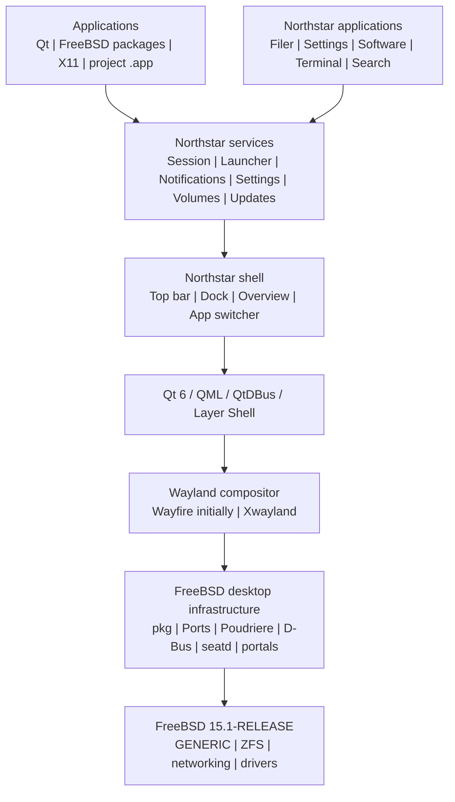

# Northstar architecture

## Layer model

Northstar is a desktop distribution and experience built on FreeBSD. It is not a replacement kernel and it is not a compatibility layer for macOS binaries.



## Fixed decisions

| Area | Decision |
| --- | --- |
| Base | FreeBSD 15.1-RELEASE |
| CPU and firmware | amd64 and UEFI only for the first supported release |
| Storage | Root-on-ZFS |
| Kernel | Upstream GENERIC, no fork |
| Display protocol | Wayland |
| X11 compatibility | Xwayland |
| Bootstrap compositor | FreeBSD-packaged Wayfire |
| Shell toolkit | Qt 6, C++20, QML |
| IPC | D-Bus with project-owned typed interfaces |
| Application discovery | Existing `.desktop` files first |
| Portable presentation | Project-defined `.app` bundles later |
| System packaging | FreeBSD `pkg` |
| Custom packaging | FreeBSD Ports overlay built by Poudriere |
| Update channels | Official FreeBSD base plus signed Northstar repository |
| Rollback | ZFS boot environments with `bectl` |
| Build | CMake and Ninja |
| Source control | GitHub monorepo |
| Native CI | Cirrus CI for FreeBSD |

The rationale and consequences are recorded in [`docs/adr/`](adr/).

## Runtime boundaries

### Session

`northstar-session` owns the user desktop lifecycle. It prepares the environment, starts the D-Bus session and compositor, launches the shell, supervises project-owned services, records non-secret diagnostics, and handles logout. It must not kill unrelated user applications merely because the shell restarts.

### Shell

The shell owns project surfaces: the top bar, dock, desktop, overview, app switcher, and system menus. It communicates with services through typed project interfaces. Layer-shell and other compositor-sensitive code is isolated behind a small platform adapter so a future compositor replacement does not require rewriting the shell.

### Services

Logical service boundaries are defined before process boundaries are split. The initial implementation may keep several services in one executable while interfaces, authorization, logging, and restart behavior stabilize.

Planned services include launcher, notifications, settings, file associations, volumes, updates, and power. The current notification slice is an in-process, bounded, session-scoped history of user-visible launch events; it never requires root access or supervises applications. The current settings slice stores only user-scoped appearance preferences through Qt's configuration path. File associations are likewise stored as user-scoped extension preferences and are validated against the current launcher catalog before use. Reboot and shutdown are controlled authorization operations, not arbitrary shell commands. Project `.app` bundles carry a source/package/revision provenance record that the launcher validates before discovery. The Software surface currently exposes a read-only `pkg query` inventory plus a strict, provenance-aware repository publication manifest, signature verification, update preview, and update-safety preflight. The M4 package-trust boundary validates the repository policy and fingerprint stores, binds publication identity and catalogue content, and verifies the application-side signature envelope against trusted fingerprints. The update boundary now has a strict root-owned request contract for bounded `bectl` create/activate operations, and an independent broker rechecks the verified publication before staging that request; package mutation and rollback remain behind the M4 service boundary.

### Applications

Application discovery starts with standard FreeBSD `.desktop` files. A project `.app` bundle is a presentation and portability format, not a replacement for FreeBSD package management. The launcher supports both formats and resolves file associations through project-owned interfaces.

### First boot

A production image enters a dedicated unprivileged setup session while a
root-owned pending marker exists. The first-boot GUI passes bounded non-secret
profile data to a fixed PolicyKit helper and streams the password once over
standard input. The helper independently validates the active setup identity,
request ownership, pending state, and allowlisted values before creating the
first administrator and permanently sealing the temporary setup path. See
[`ADR 0010`](adr/0010-first-boot-provisioning-boundary.md).

### Installer

Installer target discovery is an unprivileged read-only boundary. The UI
rejects malformed records, blocks active and undersized disks, and requires an
exact device-name plus erasure acknowledgement before it can prepare a review
plan. It cannot mutate storage. A later fixed privileged engine must rediscover
and revalidate target identity immediately before any destructive operation;
see [`ADR 0011`](adr/0011-installer-target-selection-boundary.md).

The first protected engine boundary independently revalidates the selected
whole disk and stages one root-owned transaction with execution disabled. It
refuses active, changed, undersized, partition, or unresolved prior targets;
see [`ADR 0012`](adr/0012-installer-engine-preflight-boundary.md). Actual disk
mutation remains a separate reviewed boundary.

Installer source trust is a second fixed boundary. Production accepts only a
root-controlled source root and release public key, verifies a detached
RSA/SHA-256 manifest signature plus payload size and digest, and stages only
after that source and the target both pass independent checks. Root-owned
sequenced journals expose active and interrupted transactions and require
explicit authenticated recovery or archival abandonment; see
[`ADR 0013`](adr/0013-installer-source-trust-and-journal.md). Signing private
keys remain external, and journal recovery still cannot mutate a disk.

Destructive installation is isolated in a separate fixed executor and separate
administrator-authenticated PolicyKit action. It consumes only the active
protected transaction and requires a root-owned installer-media marker plus
exact whole-disk confirmation. It repeats source and target verification,
journals GPT/EFI/ZFS/extraction/bootloader phases, cleans up mounts and pools on
failure, and never honors production environment overrides; see
[`ADR 0014`](adr/0014-guarded-installer-execution.md). Ordinary installed
systems and DEV01 do not receive the execution marker.

An interrupted execution is never resumed in place. A separate fixed
non-mutating recovery helper can export only a bounded allowlisted diagnostic
record or, after marker, journal, target identity, quiescence, and exact-device
confirmation checks, archive the failed attempt and release the engine for a
brand-new reviewed transaction. The unprivileged installer writes the
sanitized diagnostic record to the user's Documents directory; root paths,
raw journals, requests, logs, credentials, and environment are excluded. See
[`ADR 0015`](adr/0015-installer-clean-retry-and-diagnostics.md).

Installer media is assembled from the accepted production QCOW2 and its
matching rootfs payload, not from the mutable development VM. The payload is
captured before live-media state exists, bound to an externally signed source
manifest, and copied onto a labeled read-only UFS partition. The assembler can
create only a new raw file on a marked disposable FreeBSD builder; it accepts
no host disk. A dedicated passwordless live-media identity receives only the
three fixed installer PolicyKit actions, and that identity, rule, key, mount,
and execution marker are excluded from the installed payload. See
[`ADR 0017`](adr/0017-installer-media-assembly-boundary.md).

## Packaging and update model

FreeBSD base and kernel updates use the official FreeBSD mechanism. Third-party desktop dependencies come from a pinned FreeBSD package source. Northstar components are built in clean Poudriere jails and published through a signed `pkg` repository. The Northstar publication sidecar records the repository revision, target ABI, package origins, source inputs, and project revisions for read-only planning; its local signature envelope verifies the sidecar/catalogue binding but does not replace `pkg` catalogue files or the repository's own signature path. Development `.app` bundles expose manifest-level provenance now. The update helper accepts only a verified, root-owned request bound to the publication identity and derived boot-environment name; actual package mutation, broker authorization, and rollback remain part of M4.

Before a major upgrade, the updater creates a named boot environment:

```text
bectl create northstar-before-<version>
```

The upgrade is successful only when the new environment boots, the shell and applications start, package metadata is valid, and user documents remain available. A failed upgrade can select the prior boot environment. Rollback protects the operating system and installed packages; it must not delete user home data.

The Northstar Recovery application exposes a separate narrow recovery view.
Its unprivileged inventory accepts only bounded, validated `bectl list -H`
records. Its authenticated action can activate only an existing environment in
the update broker's `northstar-before-...` namespace after exact-name
confirmation and post-action verification. It cannot create, delete, rename,
mount, export, or reboot; see [`ADR 0016`](adr/0016-boot-environment-recovery-boundary.md).

## Reproducibility

Every release definition records the FreeBSD release, architecture, Ports branch and commit, resolved package versions, project commit, build host, compiler, and artifact checksum. Release builds reject `latest`, unpinned source branches, arbitrary downloads, missing checksums, and unresolved package versions.

The planning manifest is [`packaging/manifests/upstream.lock`](../packaging/manifests/upstream.lock). Its unresolved fields remain intentional at M0 and block a release build until later packaging work resolves them.

## Security boundaries

- The desktop session and shell run as an unprivileged user.
- D-Bus interfaces are typed and authorization-aware.
- Reboot, shutdown, update, and volume operations use narrow privileged helpers or established FreeBSD mechanisms.
- Release signing keys stay outside public pull-request runners.
- Public fork code never reaches a persistent privileged package or image builder.
- Logs are useful for diagnosis but exclude credentials, tokens, and private keys.

## Deferred architecture

The following remain intentionally replaceable or deferred: the compositor implementation, a full graphical installer, a new package manager, universal third-party global menus, the final `.app` runtime policy, ARM64 and Apple hardware, and any form of macOS binary compatibility.
