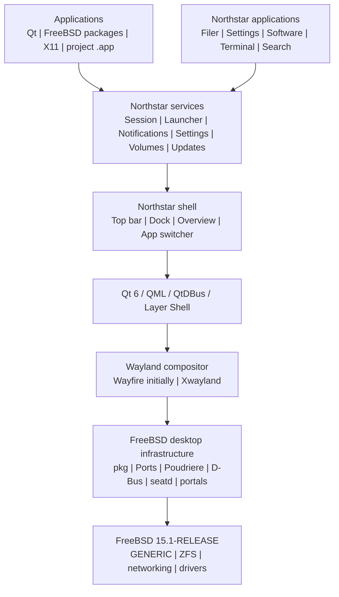

# Northstar architecture

## Layer model

Northstar is a desktop distribution and experience built on FreeBSD. It is not a replacement kernel and it is not a compatibility layer for macOS binaries.



## Fixed decisions

| Area | Decision |
| --- | --- |
| Base | FreeBSD 15.1-RELEASE |
| CPU and firmware | amd64 and UEFI only for the first supported release |
| Storage | Root-on-ZFS |
| Kernel | Upstream GENERIC, no fork |
| Display protocol | Wayland |
| X11 compatibility | Xwayland |
| Bootstrap compositor | FreeBSD-packaged Wayfire |
| Shell toolkit | Qt 6, C++20, QML |
| IPC | D-Bus with project-owned typed interfaces |
| Application discovery | Existing `.desktop` files first |
| Portable presentation | Project-defined `.app` bundles later |
| System packaging | FreeBSD `pkg` |
| Custom packaging | FreeBSD Ports overlay built by Poudriere |
| Update channels | Official FreeBSD base plus signed Northstar repository |
| Rollback | ZFS boot environments with `bectl` |
| Build | CMake and Ninja |
| Source control | GitHub monorepo |
| Native CI | Cirrus CI for FreeBSD |

The rationale and consequences are recorded in [`docs/adr/`](adr/).

## Runtime boundaries

### Session

`northstar-session` owns the user desktop lifecycle. It prepares the environment, starts the D-Bus session and compositor, launches the shell, supervises project-owned services, records non-secret diagnostics, and handles logout. It must not kill unrelated user applications merely because the shell restarts.

### Shell

The shell owns project surfaces: the top bar, dock, desktop, overview, app switcher, and system menus. It communicates with services through typed project interfaces. Layer-shell and other compositor-sensitive code is isolated behind a small platform adapter so a future compositor replacement does not require rewriting the shell.

### Services

Logical service boundaries are defined before process boundaries are split. The initial implementation may keep several services in one executable while interfaces, authorization, logging, and restart behavior stabilize.

Planned services include launcher, notifications, settings, file associations, volumes, updates, and power. Reboot and shutdown are controlled authorization operations, not arbitrary shell commands.

### Applications

Application discovery starts with standard FreeBSD `.desktop` files. A project `.app` bundle is a presentation and portability format, not a replacement for FreeBSD package management. The launcher supports both formats and resolves file associations through project-owned interfaces.

## Packaging and update model

FreeBSD base and kernel updates use the official FreeBSD mechanism. Third-party desktop dependencies come from a pinned FreeBSD package source. Northstar components are built in clean Poudriere jails and published through a signed `pkg` repository.

Before a major upgrade, the updater creates a named boot environment:

```text
bectl create northstar-before-<version>
```

The upgrade is successful only when the new environment boots, the shell and applications start, package metadata is valid, and user documents remain available. A failed upgrade can select the prior boot environment. Rollback protects the operating system and installed packages; it must not delete user home data.

## Reproducibility

Every release definition records the FreeBSD release, architecture, Ports branch and commit, resolved package versions, project commit, build host, compiler, and artifact checksum. Release builds reject `latest`, unpinned source branches, arbitrary downloads, missing checksums, and unresolved package versions.

The planning manifest is [`packaging/manifests/upstream.lock`](../packaging/manifests/upstream.lock). Its unresolved fields are intentional in PR 1 and block a release build until M0 packaging work resolves them.

## Security boundaries

- The desktop session and shell run as an unprivileged user.
- D-Bus interfaces are typed and authorization-aware.
- Reboot, shutdown, update, and volume operations use narrow privileged helpers or established FreeBSD mechanisms.
- Release signing keys stay outside public pull-request runners.
- Public fork code never reaches a persistent privileged package or image builder.
- Logs are useful for diagnosis but exclude credentials, tokens, and private keys.

## Deferred architecture

The following remain intentionally replaceable or deferred: the compositor implementation, a full graphical installer, a new package manager, universal third-party global menus, the final `.app` runtime policy, ARM64 and Apple hardware, and any form of macOS binary compatibility.
